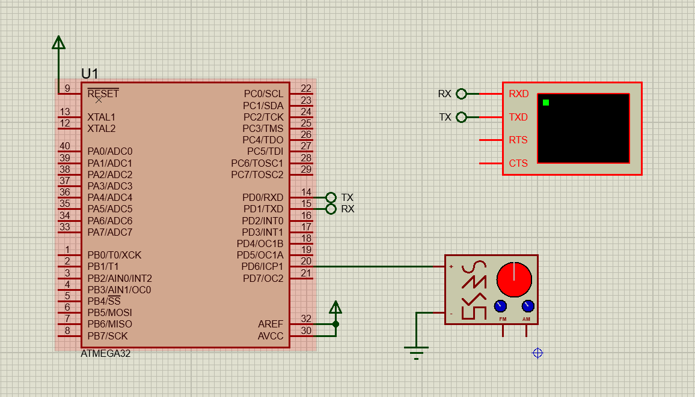
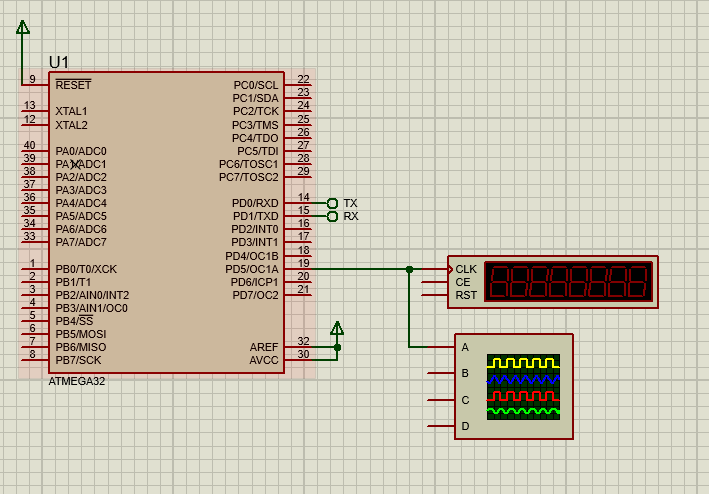
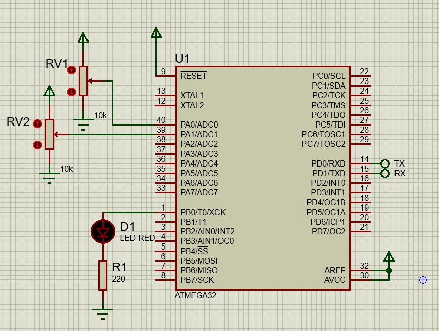
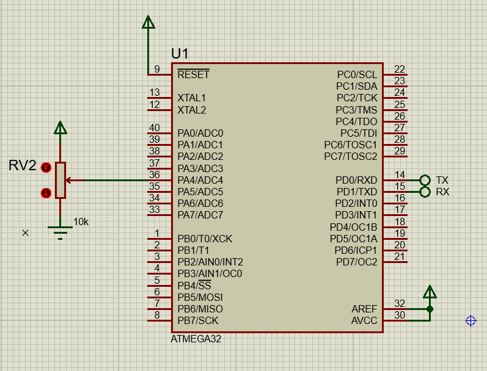
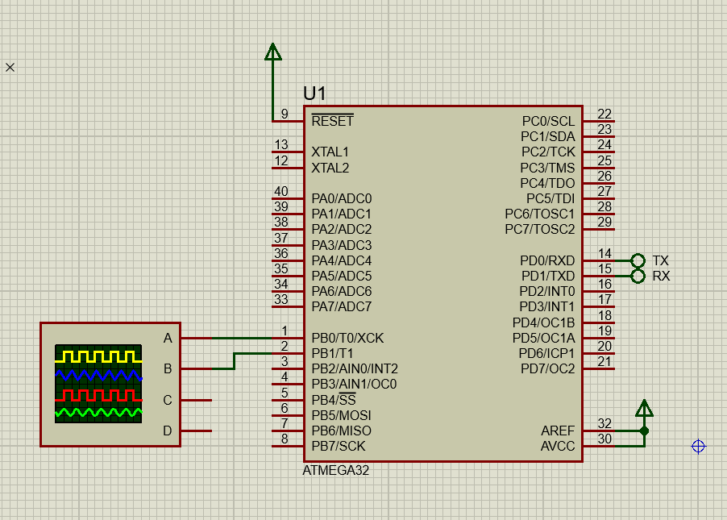
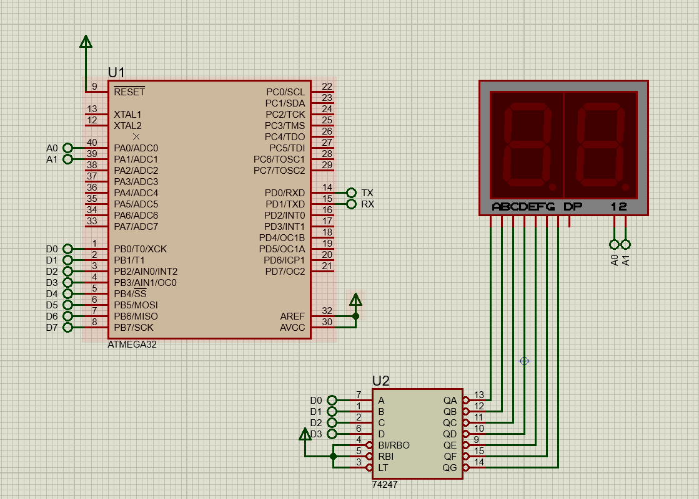
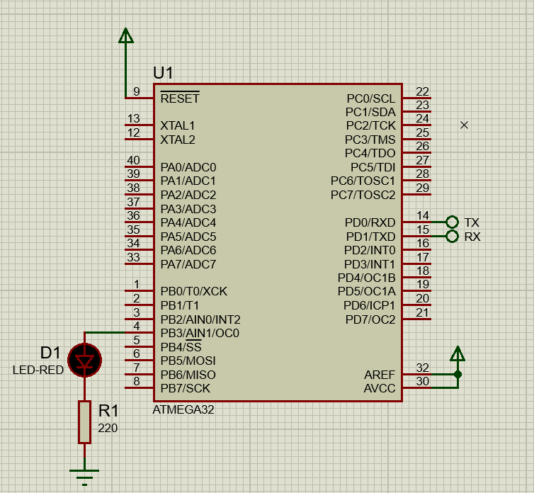

# Embedded Systems Revision

---

## Task 1: Input Capture for Frequency Measurement

Write a C interrupt-driven program using Timer 1 Input Capture to measure the period of a square wave signal. Use terminal output to display the frequency.

**Assumptions:**
- Internal XTAL = 1 MHz  
- No prescaler  
- Baud Rate = 4800  

📷 Screenshot:  

---

## Task 2: PWM Control of Servo Motor

Drive an S3003 servo motor to a specific angular position using a 50Hz PWM signal with 7.5% duty cycle. Use Timer 1 in Phase Correct PWM mode.

📷 Screenshot:  

---

## Task 3: Auto-Triggered ADC Display

Use the ADC in auto-trigger mode to start conversions every 1 second. Display the top 8 bits of the result on PORTC.

---

## Task 4: Joystick Polling and LED Trigger

Digitize two analog joystick outputs using polling. If either output deviates significantly from neutral (500 ± 300), turn on LED on PORTB.0.

📷 Screenshot:  

---

## Task 5: ADC Polling on ADC4

Perform analog-to-digital conversion using polling on ADC4.  
- Reference: AVCC  
- Prescaler: 2  
- Left-aligned result  
Display top 8 bits on PORTB.

📷 Screenshot:  

---

## Task 6: Timer Overflow Delay and Square Wave Generation

Create a function that delays for `n` seconds using Timer 1 overflow interrupts.  
Simultaneously generate:
- 4s square wave on PB0  
- 10s square wave on PB1  

📷 Screenshot:  

---

## Task 7: Infrared Intrusion and Buzzer Alert

Create an interrupt-driven program to:
- Activate buzzer on intrusion (PD.3)
- Turn off buzzer with switch on PA.0  
- Buzzer connected to PB.7

---

## Task 8: UART Message Every 2 Seconds

Send the value of PORTB through the serial port every 2 seconds using Timer 1.  
Message format: `"Port B = $value"`  
Serial: 9600 bps, 8N1, XTAL = 11.0592 MHz

---

## Task 9: 2-Digit 7-Segment Counter

Display numbers 0–99 on 2 common anode 7-segment displays.  
- PORTB for segments  
- PA0, PA1 for digit control  
- Increment every 1s  
- Refresh rate: 5ms  

📷 Screenshot:  

---

## Task 10: Square Wave Generation and Frequency Display

Generate 400Hz square wave using Timer 0.  
Use input capture to measure frequency and display on LCD (connected to PORTA).  
Use CodeVision's alphanumeric LCD library.

📷 Screenshot:  

---

## Task 11: LED Blinking with Timer 0

Toggle LED on PB3 every 0.5 seconds using Timer 0 interrupts.

📷 Screenshot:  

